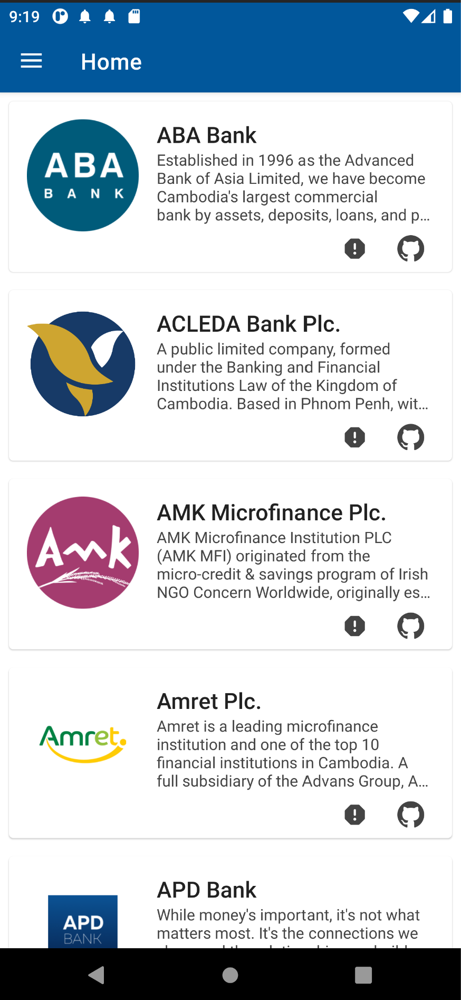

# ABAUIClone
An Android UI clone of Cambodia's mobile banking apps.

# Project Specs 
  - Language: Kotlin
  - UI Design system: XML-based
  - Design pattern: MVVM

# Screenshots: 

    

# Disclaimer 
This clone is created for education purpose only. By the time you're seeing this, the actual UIs of these apps might be updated already. 
